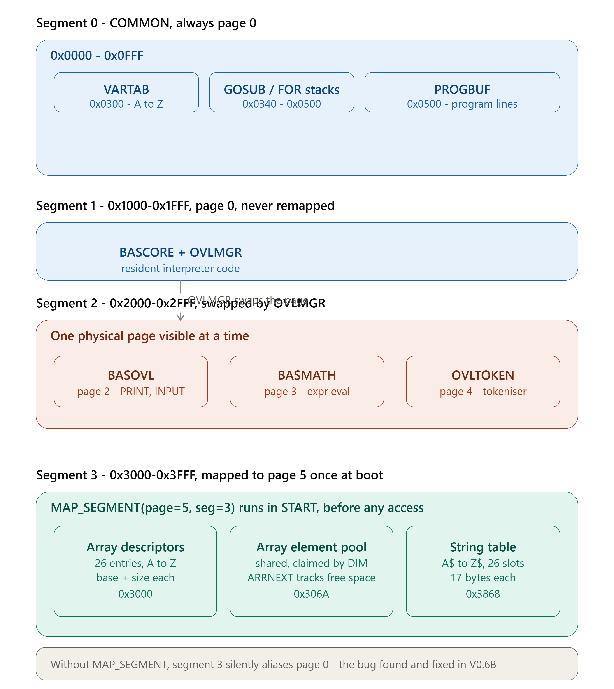
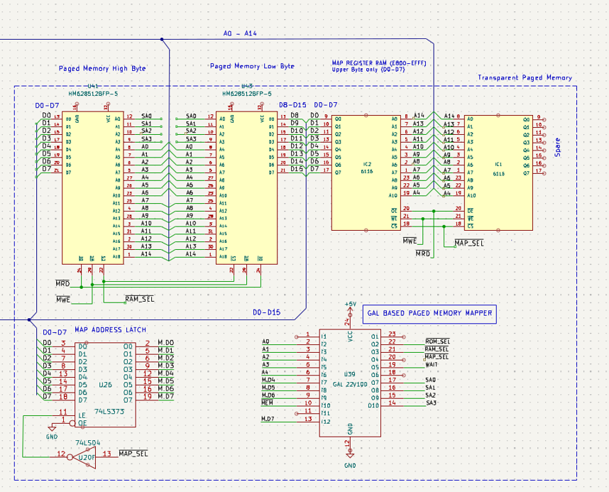
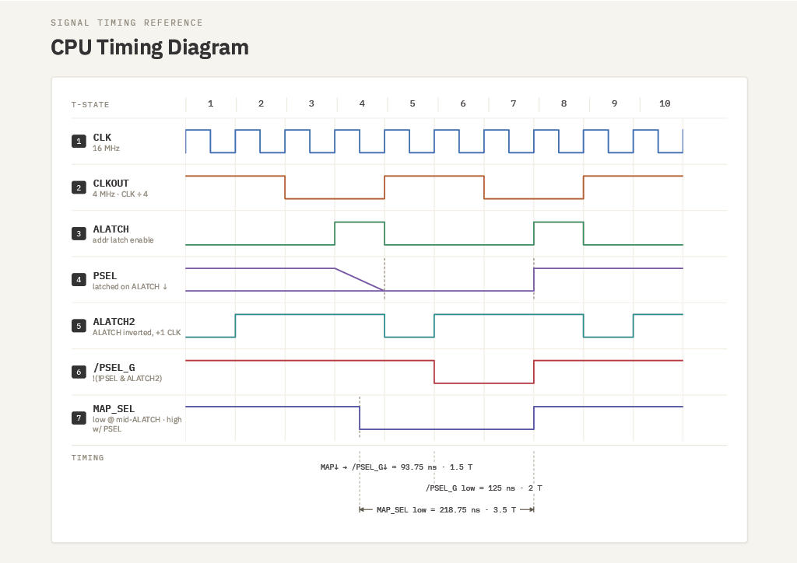

# TMS99105 SBC Transparent Paged Memory

## Overview

This document describes the memory mapper implementation for a TMS99105 SBC. Memory Mappers allow access virtual memory through the use a technique that uses the large physical memory to appear as if it is available to the CPU limited 64k Bytes addressing range.  Memory is organised into 4k memory segments, but each of these segments, addressed using high memory bit A0 to A3 to access 16 pages at that segment address.   Thus say, segment 2 (0x2000) has 16 x 4k pages sitting behind it that can be mapped in and out as required.  This transparent mapping is the job of the Overlay Manager.  A vivid example how this works in the case of a BASIC99 Interpreter is shown in the diagram below.

<p align="center">
  
</p>

## Memory Mapper Schematic 
<p align="center">
    
</p>
*Schematic showing the GAL22V10 (U44) page mapper, 6116 mapper RAM (IC4), 74LS157 segment address multiplexer (U26), and CRU interface (U31). Note: when PSEL_G is high, SA0-SA3 are forced low — all segments map to physical page 0.*

## Page Mapper Timing 

The key design criteria for this memory mapper to work is to ensure that the addresses have enough time to get from the 6116 to the GAL during the memory cycle - this is done by allowing the true PSEL (from the CPU that derives the MAP_SEL), to to enable the 6116 as soon as ALATCH goes high and to use this to also derive a secondary PSEL_G signal that is delayed by one 16MHz clock cycle relative to the falling edge of the true PSEL.  This is achieved by clocking PSEL with an inverted ALATCH signal inside the GAL.  Thus while PSEL_G is high the paged address lines are clamped low and are become valid once PSEL_G goes low. 



## Hardware — GAL22V10 Page Mapper

The SBC uses a GAL22V10 (U44) as a page mapper providing:

- 16 virtual segments × 4KB = 64KB virtual address space
- 16 physical pages × 4KB = 64KB physical RAM (from 512KB HM628512)
- CRU-based programming via `LDCR`/`STCR` at `MAP_WIN_BASE = 0x80C0`
- PSEL controlled via ST7 in the status register (set by XOP 2 handler)

### Memory Map

```
0x0000-0x00AF  Interrupt Vectors (7 user vectors at 0x00B0)
0x00B0-0x012F  Interrupt Workspace (8 x 16 bytes)
0x0130-0x022F  XOP Workspace (16 x 16 bytes)
0x0230-0x04FF  Common Workspace, Command Line, FCB, Page Variables
0x0280         Common Stack Pointer
0x02A0         OVL_PRINT_VEC (overlay print callback vector)
0x0300-0x04FF  Loader area (free RAM after EXE launch)
0x0500-0x08FF  EXE staging buffer (two sectors, 0x400 bytes)
0x0900-0x0FFF  Free RAM (stack grows down from 0x1000)
0x1000-0xCFFF  TPA — Paged Program Area (page 0 by default)
0xD000         SHELL
0xE000         BDOS
0xF000         ROM / DISC_MONITOR
```

### Key Equates

```asm
MAP_WIN_BASE:   EQU  080C0H      ; CRU base for mapper registers
BYTEWIDE:       EQU  2           ; CNT=2 = parallel byte transfer mode
PSEL_EN:        EQU  0100H       ; non-zero = enable PSEL (any non-zero value)
OVL_SEG:        EQU  2           ; virtual segment used for overlay slot
OVL_CRU:        EQU  MAP_WIN_BASE+(OVL_SEG*2)  ; = 0x80C4
OVL_PRINT_VEC:  EQU  02A0H       ; page variables area — print callback
STAGING:        EQU  0500H       ; sector staging buffer
FLATBASE:       EQU  1000H       ; flat program load address
```

## Programming the Mapper

### LDCR/STCR in Parallel Mode

On the TMS99105A, `LDCR`/`STCR` with `CNT=2` (`BYTEWIDE`) operate in **parallel byte transfer mode** — transferring a full byte, not 2 bits.

- `LDCR Rsrc,BYTEWIDE` — writes the **high byte** of Rsrc to the CRU address in R12
- `STCR Rdst,BYTEWIDE` — reads a byte from CRU into the **high byte** of Rdst

To program a mapper register:

```asm
MAP_SET:
    ; Entry: R9 = segment number, R0 = physical page number
    LI   R12,MAP_WIN_BASE       ; CRU base
    SLA  R9,1                   ; segment * 2 = CRU bit offset
    A    R9,R12                 ; R12 = CRU address for this segment
    SLA  R0,8                   ; move page to high byte for LDCR
    LDCR R0,BYTEWIDE            ; program the mapper register
    RT
```

To read back a mapper register:

```asm
    LI   R12,OVL_CRU
    STCR R1,BYTEWIDE            ; page number in HIGH BYTE of R1
    ; DO NOT SLA R1,8 — result is already in the high byte
```

### PSEL Control

PSEL is controlled via XOP 2. The XOP 2 handler sets/clears ST7 (the map enable bit):

```asm
    ; Enable PSEL
    LI   R9,PSEL_EN             ; any non-zero value
    PSEL R9                     ; XOP 2 — sets ST7, enables mapping

    ; Disable PSEL
    CLR  R9
    PSEL R9                     ; XOP 2 — clears ST7, disables mapping
```

**Important:** XOP entry clears ST7-ST11. The XOP 2 handler sets ST7 via `ORI` on the saved status before `RTWP`, so PSEL state is correctly restored on return.

**Important:** With PSEL enabled (ST7=1), the processor is in **user mode**. Privileged instructions (`LWPI`, `LIMI`, `LST`) must only be executed with PSEL disabled or before PSEL is first enabled.

## Output File Format — Shell V5.x EXE

When overlays are linked with `-P#` flags, `link99` produces a single **EXE file** in Shell V5.x chain-block format. There are no separate overlay files — everything is in one EXE launched directly from the shell.

The shell identifies an EXE by its file type field in the FCB (`FTY`), not by reading the file contents. The EXE file itself contains **no sentinel or pagemap prefix** — it consists entirely of chain blocks from byte 0 (link99 v3.9.12+).

### Chain Block Format

```
[next_offset:word][page:word][start:word][size:word][data...]
```

- `next_offset` — byte distance from this header to the next (0 = last block)
- `page` — physical page number (0 = common memory, no mapper programming needed)
- `start` — virtual load address
- `size` — byte count of data following the header

Large modules are automatically split into multiple blocks, each limited to `0x1F8` bytes (one 512-byte sector minus the 8-byte header) to keep chain arithmetic aligned to sector boundaries.

### Loader Operation

`LOADERCODE_EXE` is copied from the shell to `0x0300` (loader area) and executes from there:

1. Clears all map registers to page 0
2. Reads two sectors (`0x400` bytes) into staging at `0x0500`-`0x08FF`
3. Walks the chain: for each block, programs the mapper if `page>0`, enables PSEL, copies `size` bytes from staging to `start`, disables PSEL
4. If staging is exhausted mid-block, reloads one sector and continues
5. If the next block header is beyond staging, reloads two sectors and repositions
6. When `next_offset=0`, launches at the first block's `start` address

There is no limit on the number of chain blocks — the loader handles arbitrary-length EXE files through its reload mechanism.

### Link Command

```
link99 prog.exe -O0x1000 -P0 main.r99 ovlmgr.r99 -P2 ovla.r99 -P3 ovlb.r99
```

| Flag | Meaning |
|------|---------|
| `-O0x1000` | Sets `cbase=0x1000` — required for correct external symbol resolution when `-P0` modules use `AORG 1000H` |
| `-P0` | Tags page-0 modules — allows the linker to resolve `EXT`/`ENT` across them |
| `-P2` | Places overlay A at virtual `0x2000`, physical page 2 |
| `-P3` | Places overlay B at virtual `0x2000`, physical page 3 |

### Why `-O0x1000` Is Needed

In page mode the linker sets `cbase=0`. Without `-O0x1000`, external symbols in a page-0 module assembled with `AORG 1000H` resolve to offsets from zero rather than from `0x1000`. `-O0x1000` corrects this so all page-0 modules resolve their external references against the correct runtime base address.

### Why OVLMGR Has No AORG

OVLMGR is assembled without an `AORG` directive, making it purely relocatable. The linker places it immediately after the main program in the page-0 segment. An `AORG 1000H` in OVLMGR would cause the linker to treat its entry point addresses as already-absolute and refuse to add the module offset, producing wrong call targets.

### EQU Constants and AORG

**EQU constants defined before `AORG` are absolute.** EQU constants defined after `AORG` inherit the relocatable segment and will be treated as relocatable references by the linker — even if their value is a small integer. Always define overlay IDs and other small constants before the `AORG` directive.

## Overlay Manager — OVLMGR

OVLMGR is a relocatable module linked with the main program in page 0. It manages swapping overlays into the fixed virtual slot at `0x2000`.

### Data

```asm
OVL_PAGES:
    WORD  0         ; unused (index 0)
    WORD  2         ; overlay A = physical page 2
    WORD  3         ; overlay B = physical page 3

CURRENT_OVL:
    WORD  0         ; currently mapped overlay ID (0 = none)
```

### OVLMGR_INIT

Call once at program startup:

```asm
    CALL  @OVLMGR_INIT     ; clears CURRENT_OVL, enables PSEL
```

### OVLMGR

Call before each overlay function:

```asm
    LI    R1,1             ; overlay ID (1=A, 2=B) — use literal, not EQU after AORG
    CALL  @OVLMGR          ; swap if needed, R1 preserved on return
```

OVLMGR compares R1 to CURRENT_OVL — if already mapped, returns immediately. Otherwise programs segment 2 with the new page. R1 is never written during the swap so it is preserved naturally. R0, R9, R12 are trashed:

```asm
OVLMGR:
    C     R1,@CURRENT_OVL
    JEQ   OVLMGR_RET           ; already loaded
    MOV   R1,@CURRENT_OVL      ; record new overlay
    MOV   R1,R3                ; R3 = overlay ID
    SLA   R3,1                 ; word offset into OVL_PAGES
    MOV   @OVL_PAGES(R3),R0    ; R0 = physical page number
    SLA   R0,8                 ; page to high byte for LDCR
    CLR   R9
    PSEL  R9                   ; disable PSEL before programming mapper
    LI    R12,OVL_CRU
    LDCR  R0,BYTEWIDE          ; program segment 2
    LI    R9,PSEL_EN
    PSEL  R9                   ; re-enable PSEL
OVLMGR_RET:
    RET
```

**Note:** You cannot use R0 as an index register on TMS9900 — `MOV @TABLE(R0),R0` does not index. Use R3 or any other non-zero register.

## Overlay Code Structure

Each overlay is assembled at `AORG 2000H` with a fixed entry point table at the start:

```asm
    AORG  2000H

OVLA_FUNC1:  B  @OVLA_F1      ; 0x2000 — entry point 1
             NOP
OVLA_FUNC2:  B  @OVLA_F2      ; 0x2004 — entry point 2
             NOP
```

Fixed entry points allow the main program to call into overlays at known addresses without needing to know where the implementation code lives within the overlay.

## Calling Overlays from the Main Program

### Print Callback Vector

Overlays cannot directly call routines in the main program since their addresses are not known at overlay assembly time. A callback vector in common memory solves this:

```asm
OVL_PRINT_VEC:  EQU  02A0H    ; page variables area
```

The main program installs the callback after `OVLMGR_INIT`:

```asm
    CALL  @OVLMGR_INIT
    LI    R0,PRINT
    MOV   R0,@OVL_PRINT_VEC
```

The overlay calls via register indirect:

```asm
    MOV   @OVL_PRINT_VEC,R0
    CALL  *R0
```

An alternative is a **trampoline** at the vector address:

```
02A0: 0460   ; B opcode
02A2: xxxx   ; target address
```

Then `CALL @0x02A0` branches through in one indirection.

### CALL and RET

Use `CALL` (XOP 6) and `RET` (XOP 7) throughout:

```asm
    DXOP  CALL,6
    DXOP  RET,7

    CALL  @OVLMGR
    CALL  @OVL_FUNC1
```
