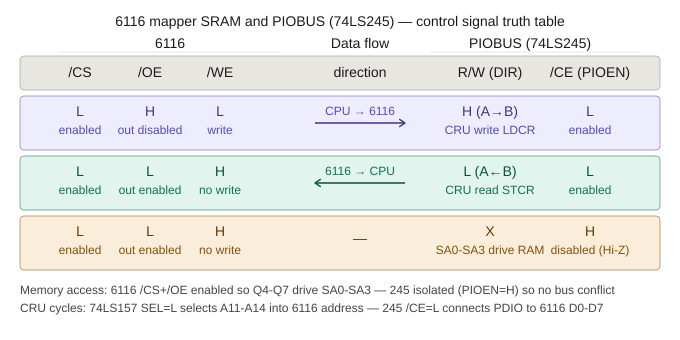

# TMS99105 SBC V4 - Paged Memory System

## Overview

The TMS99105 SBC V4 implements a transparent paged memory system providing 1MB of physical RAM via two HM628512BFP-5 512KB SRAM chips (word-wide). The system divides the 64KB address space into 16 × 4KB segments, each independently mappable to one of 16 × 64KB physical pages.

## Architecture

### Schematic


### Truth Table


### Memory Map
```
0x0000-0x0FFF  COMMON    Always page 0 - OS, workspace, XOP vectors
0x1000-0xEFFF  PAGED TPA 14 × 4KB segments, independently mappable
0xF000-0xFFFF  ROM       Monitor/OS in EPROM
```

### Physical RAM
- 2 × HM628512BFP-5 (512KB each, word-wide = 1MB total)
- SA0-SA3 select physical page (0-15) within each chip
- SA0 = MSB (TMS99105 big-endian convention)

### Mapper Hardware
```
Component    Function
─────────────────────────────────────────────────────────
6116 SRAM    16 × 8-bit page registers (one per segment)
74LS157      MUX: CRU address (A11-A14) or CPU address (A0-A3) → 6116
GAL22V10     Address decode + SA0-SA3 registered outputs
```

### GAL22V10 (U44) - Rev 24Q
# TMS99105 SBC Memory Management Unit (U44 GAL22V10)

This directory hosts the logic equations and hardware specifications for the **GAL22V10 MMU / Memory Mapper** utilized in the TMS9900 Single Board Computer (SBC) Version 4 layout.

## Memory Map Topology

The System MMU segments the 64KB address space of the TMS99105 processor into three operational spaces based on the high nibble of the address bus ($A_0 - A_3$):

| Address Range | Logic Name | Selection Line | Behavior / Paging Profile |
|---|---|---|---|
| `0x0000 - 0x0FFF` | `COMMON` | `RAM_SEL` active | Always locked to Physical Page 0 (`SA0-SA3 = 0`). Power-on safe. |
| `0x1000 - 0xEFFF` | `PAGED` | `RAM_SEL` active | Paged via 6116 Mapper SRAM mapping when `PSEL` is LOW. |
| `0xF000 - 0xFFFF` | `ROM` | `ROM_SEL` active | Routes to system ROM. Enforces Hardware `WAIT` states. |

*Note: The `0xE800 - 0xEFFF` range (`MAP_WIN`) from earlier revisions has been reclaimed and now acts as normal paged RAM.*

---

## Hardware Architecture & Interface Strategy

The V4 subsystem simplifies the mapping interconnect by utilizing a direct write-path strategy over the CRU (Communications Register Unit) bus, completely bypassing memory-bus buffer chips.
---

/*=========================================================
  MEMORY MAP
  0x0000-0x0FFF  COMMON  RAM_SEL  SA=0000 always page 0
  0x1000-0xEFFF  PAGED   RAM_SEL  SA=PIO_D4-D7 when PSEL LOW
  0xF000-0xFFFF  ROM     ROM_SEL

  0xE800-0xEFFF now normal paged RAM - MAP_WIN removed

```

### CRU Mapper Interface
- Base address: **0x80C0H**
- 16 registers at 80C0H, 80C2H ... 80DEH
- Written via LDCR (2 bits, page value in high byte)
- Read via STCR

### PSEL (TMS99105 PIN 31)
- LOW = paging enabled (SA driven from 6116)
- HIGH = paging disabled (SA = 0000, flat memory)
- Forced HIGH by: XOP, RTWP, interrupts, all I/O instructions
- Controlled via XOP 2

## Programming Model

### Initialisation
```asm
; Clear all page registers (all segments → page 0)
BL      @MAP_CLR

; Enable paging - leave enabled throughout application
LI      R9, 0100H
PSEL    R9
```

### Page Register Setup
```asm
; MAP_SET - Entry: R9=segment, R0=page
MAP_SET:
    LI      MAP_PORT, 80C0H
    SLA     R9, 1           ; segment * 2
    A       R9, MAP_PORT    ; point to register
    SLA     R0, 8           ; page to high byte
    LDCR    R0, 2           ; write to 6116
    RT
```

### Accessing Paged Memory
```asm
; Set page register
LI      R9, 2       ; segment 2
LI      R0, 5       ; page 5
BL      @MAP_SET

; Enable paging (once at startup - leave enabled)
LI      R9, 0100H
PSEL    R9

; Access paged memory transparently
LI      R2, 2000H   ; segment 2 base address
MOV     *R2, R1     ; read from segment 2, page 5
MOV     R1, *R2     ; write to segment 2, page 5
```

## Test Utility - MAPDEBUG

Load at 0x0500. Parameters at fixed addresses:
```
0502: COMMAND
0504: SEG_PAGE   HIGH=PAGE(0-15)  LOW=SEG(0-15)
0506: VALUE      write value (CMD 5)
```

### Commands
```
1=PSEL_EN   Enable mapping
2=PSEL_DIS  Disable mapping
3=SMREG     Set map register + verify (0504=SEG:PAGE)
4=RMREG     Read map register (0504=SEG:PAGE)
5=WPGSEG    Write value to SEG:PAGE (0504=SEG:PAGE 0506=VAL)
6=RPGSEG    Read from SEG:PAGE (0504=SEG:PAGE)
7=MAP_CLR   Initialise - set all segments to page 0
8=MAP_LST   List all map registers
9=RDLOOP    Continuous read loop (reset to exit)
A=PGLOOP    Cycle all pages on segment (reset to exit)
B=HELP      Help
C=SETALL    Set seg N = page N for segs 0-14, seg15=page0
D=SCYC      PSEL boundary cycle for scope analysis (reset to exit)
E=INIT      Init segs 0-14 = seg N, seg15=page0
F=CODE      Cross-page code execution test
```

### Test Sequence
```
; Prove page isolation:
E 0502 0007 / 500G          ; clear all registers
E 2000 1234                 ; write 1234 to page 0 seg 2
E 0502 0005
E 0504 0102                 ; seg 2, page 1
E 0506 A5A5 / 500G          ; write A5A5 to page 1
E 0502 0006 / 500G          ; read back - should be A5A5
2000                        ; page 0 should still be 1234

; Code execution test:
E 0502 000F / 500G          ; RESULT:BEEF PASS
```

## Hardware Summary

| Signal | Source | Destination | Function |
|--------|--------|-------------|----------|
| MAP_SEL | U30B pin 10 | U26 SEL, 6116 /CS | CRU mapper select |
| RAM_SEL | GAL PIN 21 | 6116 /CS (ANDed) | RAM cycle select |
| IOWR | U14 | 6116 /WE, /OE via U38B | CRU write strobe |
| PIO_D4-D7 | 6116 Q4-Q7 | GAL PIN 7,8,9,13 | Page value to GAL |
| SA0-SA3 | GAL PIN 17,16,15,14 | HM628512 A0-A3 | Physical page select |
| PSEL | CPU PIN 31 | GAL PIN 11 | Mapping enable |
| 16MHz CLK | Oscillator | GAL PIN 1 | SA register clock |


