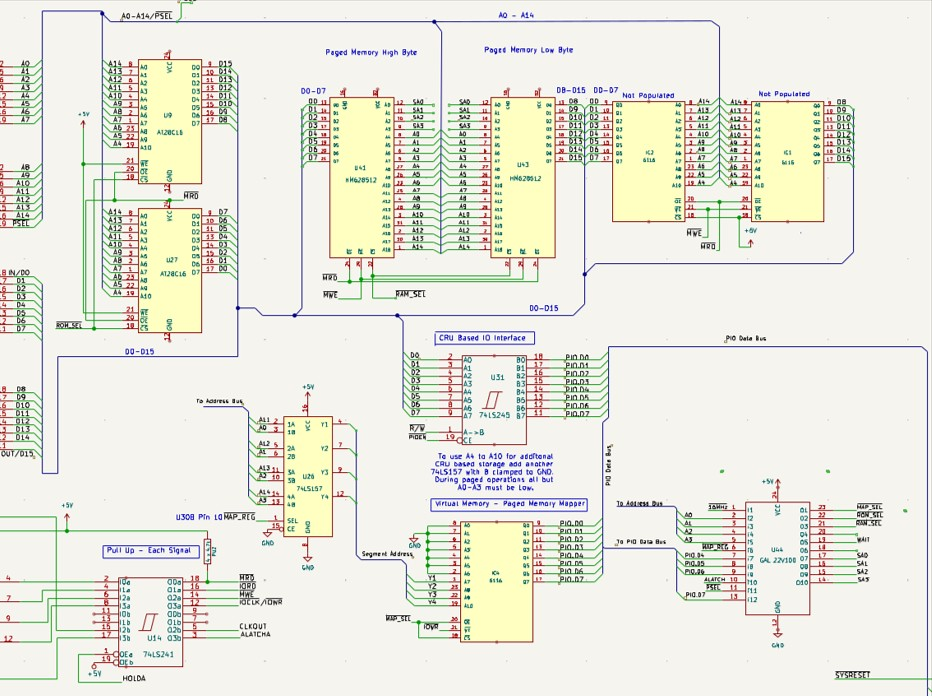
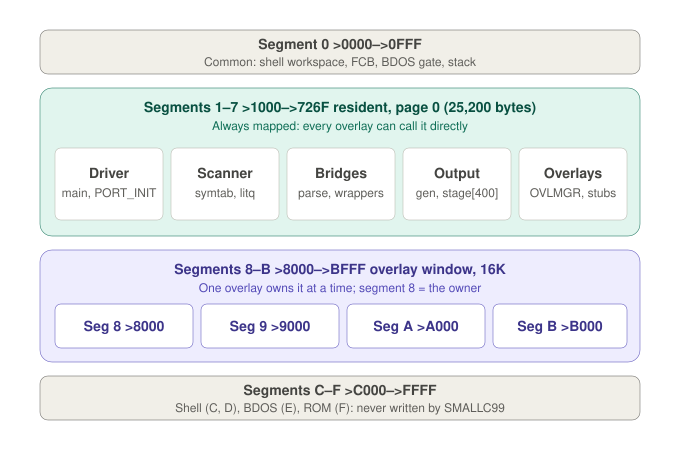
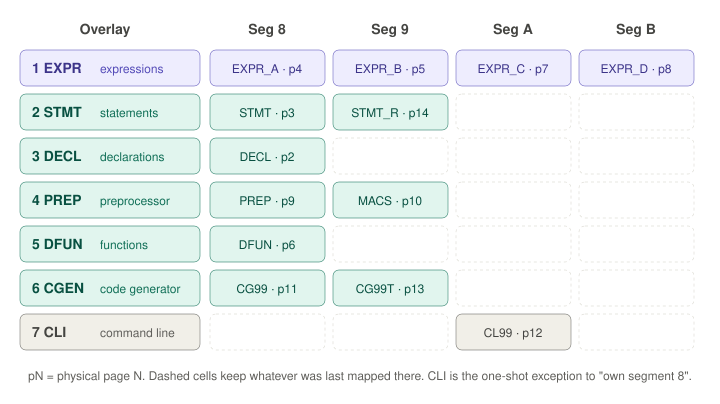

# TMS99105 SBC Transparent Paged Memory

This document describes the memory mapper on the TMS99105 SBC in three parts:

1. [The memory mapper](#part-1--the-memory-mapper) — what it does, and the hardware that does it
2. [Example: the SMALLC99 compiler](#part-2--example-the-smallc99-compiler) — how a large program uses it
3. [Programming and using the mapper](#part-3--programming-and-using-the-mapper) — the instructions, file format, linker and overlay manager

## Part 1 — The memory mapper

### How it works

The TMS99105 can address only 64K bytes. This SBC's memory mapper lets it use
far more physical memory than that, by swapping blocks of memory in and out of
the 64K address space as a program needs them.

The address space is divided into sixteen **segments** of 4K each: segment 0
is `>0000`–`>0FFF`, segment 1 is `>1000`–`>1FFF`, and so on up to segment F at
`>F000`. Behind every segment sit sixteen physical **pages** of 4K, and a
small **map register** for each segment says which of its pages the CPU
currently sees there. The mapper supplies the page number on extra high
address lines (SA0–SA3), so changing one map register changes what appears in
that one 4K segment and nothing else. Sixteen segments with sixteen pages each
gives 1MB of physical memory in total.

Page 0 behind every segment, taken together, is the ordinary flat 64K the
system boots with. Mapping is switched on and off as a whole by **PSEL**: with
PSEL off, every segment shows page 0; with PSEL on, each segment shows the page
its map register names.

Deciding which page belongs in which segment, and switching them at the right
moments, is the job of an **overlay manager**.

### Memory Mapper Schematic

Most designs would just add a 74LS612 memory mapper, but you can build your own
with just a 74LS157 multiplexer and a 6116 2K memory chip. The 74LS157
multiplexes the different address lines depending on the state the memory
mapper is in. There are two states: one where the memory chip is programmed
with the segment pages, and the other where it outputs the page number for a
given segment on the upper address lines SA0 to SA3. For example, the third
memory address holds the page number for segment 2 (`>2000`–`>2FFF`); this page
number can change when you need to swap in another page. For this to be useful
you must of course have physical memory much larger than the 64K bytes the CPU
can address.

<p align="center">
    
</p>

*Schematic showing the GAL22V10 (U44) page mapper, 6116 mapper RAM (IC4),
74LS157 segment address multiplexer (U26), and CRU interface (U31). Note: when
PSEL_G is high, SA0–SA3 are forced low — all segments map to physical page 0.*

### Page Mapper Timing

The key design criterion for this memory mapper is to ensure that the addresses
have enough time to get from the 6116 to the GAL during the memory cycle. This
is done by allowing the true PSEL (from the CPU, which derives MAP_SEL) to
enable the 6116 as soon as ALATCH goes high, and by using it to derive a
secondary PSEL_G signal that is delayed by one 16MHz clock cycle relative to
the falling edge of the true PSEL. This is achieved by clocking PSEL with an
inverted ALATCH signal inside the GAL. Thus while PSEL_G is high the paged
address lines are clamped low, and they become valid once PSEL_G goes low.


### Hardware — GAL22V10 Page Mapper

The SBC uses a GAL22V10 (U44) as a page mapper providing:

- 16 virtual segments × 4KB = 64KB virtual address space
- 16 physical pages behind each segment: 16 segments × 16 pages × 4KB = 1MB physical RAM
- CRU-based programming via `LDCR`/`STCR` at `MAP_WIN_BASE = 0x80C0`
- PSEL controlled via ST7 in the status register (set by the PSEL XOPs)

### How the address space is used

As used by Shell 6.5:

```
0x0000-0x00AF  Interrupt Vectors (7 user vectors at 0x00B0)
0x00B0-0x012F  Interrupt Workspace (8 x 16 bytes)
0x0130-0x022F  XOP Workspace (16 x 16 bytes)
0x0230-0x024F  Shell workspace (R0-R15)
0x0250         Command line
0x0280         Common FCB
0x02A0-0x02E7  Shell overlay variables (OVL_PRINT_VEC at 0x02A0)
0x02E8         LGATE - launch gate:  PSEL on, branch to program
0x02F0         RGATE - return gate:  PSEL off, back to the shell
0x02F6         BGATE - BDOS gate:    PSEL off, call BDOS, PSEL on
0x0300-0x04FF  Loader area / sector buffer (free RAM after EXE launch)
0x0500-0x08FF  EXE staging buffer (two sectors, 0x400 bytes)
0x0900-0x0FFF  Free RAM (stack grows down from 0x0FFE)
0x1000-0xBFFF  TPA - Paged Program Area (page 0 by default); a .COM may
               also use 0xC000-0xDFFF, which the shell swaps to page 1
0xC000         SHELL core (0xC000-0xD911)
0xD000         Shell command window: DIR, TYPE, ERA ... each in its own page
0xE000         BDOS
0xF000         ROM / DISC_MONITOR
```

The area `0x02A0`–`0x02FF` belongs to the shell. Applications must not store
anything there (see [Calling between the program and its overlays](#calling-between-the-program-and-its-overlays)).

## Part 2 — Example: the SMALLC99 compiler

### Why it needs the mapper

SMALLC99 is a Small-C compiler that runs on the SBC itself. It is far too big
to fit in 64K alongside the shell and the BDOS, so it is built as one
**resident** part that is always present, plus seven **overlays** that take
turns in a shared 16K **overlay window**.

<p align="center">
  
</p>

- **Segment 0** is common memory: the shell's workspace, the FCB, the gates
  and the stack. It is always page 0, whatever PSEL says.
- **Segments 1–7** hold the resident compiler (25,200 bytes) in page 0. These
  map registers stay at 0, so the resident code is visible whether PSEL is on
  or off.
- **Segments 8–B** (`>8000`–`>BFFF`) are the overlay window. Whichever overlay
  is active has its pages mapped here.
- **Segments C–F** belong to the shell, the BDOS and the ROM. The loader
  refuses to put any program code there.

Compared with the minimal overlay manager in Part 3, SMALLC99 scales
everything up: a four-segment window instead of one segment, overlays that span
several pages, and overlays that call each other. This part describes what goes
where and why. The mechanisms it relies on — programming map registers, the EXE
file format, `link99 -P` and the overlay manager itself — are covered in
[Part 3](#part-3--programming-and-using-the-mapper).

### What the parts of a compiler do

A C compiler reads source text and writes assembly language. SMALLC99 does this
in the classic single-pass way: it reads a declaration or function, parses it,
and emits code for it straight away. The work falls into a few jobs, and each
overlay does one of them:

| Overlay | Stands for | What it compiles or does | Example source it handles |
|---------|-----------|--------------------------|---------------------------|
| 1 `EXPR` | **Expressions** | Operators, precedence, assignments, function calls, constants | `a = b + f(c) * 2` |
| 2 `STMT` | **Statements** | Control flow: `if`, `while`, `do`, `for`, `switch`/`case`, `return`, `break`, `goto`, compound `{ }` blocks | `if (x > 0) y = 1;` |
| 3 `DECL` | **Declarations** | Global and static variable declarations and their initial values | `int count; char buf[80];` |
| 4 `PREP` | **Preprocessor** | `#define`, `#include`, `#if`/`#ifdef`, `#asm`, macro expansion, reading source lines | `#define TEN 10` |
| 5 `DFUN` | **Define function** | A function definition: its header, arguments and parameter declarations, then its body | `add(a, b) int a, b; { ... }` |
| 6 `CGEN` | **Code generator** | Turns the compiler's internal operation codes into TMS9900 assembly text | (produces `MOV`, `A`, `BL` … lines) |
| 7 `CLI` | **Command-line interface** | Reads the command line: source and output names, `-V` and other options | `SMALLC99 TEST -V` |

The resident part holds everything the overlays share:

| Resident module | What it does |
|-----------------|--------------|
| `SMALLC99.C` | The driver: `main()` calls the CLI, opens the files, runs the parse loop and closes up |
| `CC_PORT.A99` | Startup: initialises the overlay manager and the trampoline stack in the right order |
| `CC_RESIDENT.C` | The top-level parse loop, and the **bridge** functions overlays call to reach each other |
| `CC_SCAN_SYM.C` | The scanner (reading characters and names from the current line), symbol table search and insertion, error reporting |
| `CC_DATA.C` | Shared data: the symbol table (`symtab`, 3,520 bytes), literal pool (`litq`), operator tables, file units |
| `CC_CD99.C` | The output layer: `gen()` and the p-code staging buffer (`stage`, 400 words), module header and trailer |
| `OVLMGR.A99` | The overlay manager |
| `OVLSTUBS.A99`, `CLISTUB.A99` | The trampolines: the only code allowed to switch overlays mid-compile |
| `SPYOUT.A99` | Low-level text output (`pstr`, `pchar`, `pdec` …) |

A **p-code** is one of the compiler's internal operation codes, such as "load
a word from the stack" or "add the two working registers". The expression and
statement code calls `gen(pcode, value)` to record what it wants done; the
code generator later turns each p-code into real assembly lines.

### The overlay table

Each overlay has a row in `OVLTABLE`, generated at build time, listing which
physical page to map into each window segment:

<p align="center">
  
</p>

The expression code shows why the window is four segments wide. The
expression engine is about 13K bytes of code — far too big for one 4K page — so
it is split across four modules, `EXPR_A` to `EXPR_D`, on pages 4, 5, 7 and 8.
When overlay 1 is mapped, all four appear at once as one continuous 16K block
at `>8000`–`>BFFF`. The split points are chosen purely by size: the precedence
levels (`level1` … `level14`), `primary()` and `callfunc()` call each other as
ordinary direct calls, exactly as if the engine were one piece of code.

The other overlays need less room. The statement code uses two segments: the
main statements in `STMT` and the rest (`break`, `continue`, `goto`, labels,
`switch` tables) in `STMT_R`. The preprocessor keeps its macro table in `MACS`
on segment 9. The code generator puts its output routine and template table
(`CG99`) in segment 8 and the code that fills the templates (`CG99T`) in
segment 9. Every module fits in its 4K page; the largest uses 4,032 bytes.

The shell's command pages also live in pages 2–10, but only in segment D. The
compiler only uses segments 8–B of those pages, so the two never share memory.

### Calling between the program and its overlays

Three kinds of call happen inside SMALLC99:

1. **Overlay → resident.** Always allowed and always direct. The resident code
   is permanently mapped in segments 1–7, and link99 resolves the addresses at
   link time. No vectors in common memory are needed.
2. **Within one overlay.** Always allowed and always direct, even between its
   different pages, because all of an overlay's pages are mapped together.
3. **Overlay → a different overlay.** Never direct. The caller calls an
   ordinary-looking resident **bridge** function (`statement()`, `test()`,
   `expression()`, `constexpr()`, `gen()` …). The bridge calls a **framed
   trampoline** (`R_STMT`, `R_TEST`, `R_EXPRVAL`, `R_CEXPR`, `R_CCOUT` …),
   which:
   - pushes the caller's return word and the current owner onto `TRSTACK`
   - calls `OVLMGR` to map the callee's overlay
   - calls the callee's fixed entry point
   - pops the frame and calls `OVLMGR` again to restore the caller's overlay

`OVLMGR` walks the overlay's table row and programs only the segments whose
page actually changes, so returning to an overlay that is still partly mapped
costs very little.

### Following one line through the window

Compiling `if (a > f(b))` inside a function body shows every kind of call:

| Step | What happens | Seg 8 | Seg 9 | Seg A | Seg B | `TRSTACK` |
|------|--------------|-------|-------|-------|-------|-----------|
| 1 | The resident parse loop finds a function and maps DFUN | DFUN | – | – | – | empty |
| 2 | `dofunction()` calls `statement()` → `R_STMT` | STMT | STMT_R | – | – | DFUN |
| 3 | `doif()` calls `test()` → `R_TEST`; all four expression pages appear | EXPR_A | EXPR_B | EXPR_C | EXPR_D | DFUN, STMT |
| 4 | `callfunc()` parses `f(b)` via `expression()` → `R_EXPRVAL`; same overlay, so no mapper writes | EXPR_A | EXPR_B | EXPR_C | EXPR_D | DFUN, STMT, EXPR |
| 5 | Staged p-codes are written out through `R_CCOUT`; CGEN takes segments 8 and 9 | CG99 | CG99T | EXPR_C | EXPR_D | DFUN, STMT, EXPR, EXPR |
| 6 | `R_CCOUT` returns; only segments 8 and 9 change back | EXPR_A | EXPR_B | EXPR_C | EXPR_D | DFUN, STMT, EXPR |
| 7 | The condition is finished; `R_EXPRVAL` and `R_TEST` return | STMT | STMT_R | EXPR_C | EXPR_D | DFUN |
| 8 | The statement is finished; `R_STMT` returns | DFUN | STMT_R | EXPR_C | EXPR_D | empty |

Segments that an overlay does not use keep whatever was last mapped there
(steps 5, 7 and 8). That is harmless, because no code runs from them.

### Rules the build enforces

- **Segment 8 is the owner.** Every overlay maps segment 8 first, and the word
  `CUR_WINA_ID` always names that overlay; the trampolines save and restore it.
  This is why CGEN occupies segments 8 and 9: when it once sat in A and B, it
  ran while the window still claimed to belong to EXPR. CLI is the one
  documented exception, because it runs only once, before compiling starts.
- **`TRSTACK` holds 16 frames**, one per live call between overlays
  (statement nesting × expression nesting). On overflow the compiler prints
  `>DEAD` and stops.
- **Never pass a pointer to an overlay's own static data through a
  trampoline.** The callee may map over it, and a store through that pointer
  lands in the callee's code. Use a stack variable and copy the result back
  afterwards.
- **Keep application vectors out of common memory.** `0x02A0`–`0x02FF` belongs
  to the shell. An early SMALLC99 build stored trampoline vectors at `0x02A2`
  and silently corrupted the shell's overlay variables. Any table overlays need
  belongs in the program's resident segments, which overlays can always reach.

## Part 3 — Programming and using the mapper

### Key Equates

```asm
MAP_WIN_BASE:   EQU  080C0H      ; CRU base for mapper registers
BYTEWIDE:       EQU  2           ; CNT=2 = parallel byte transfer mode
PSEL_EN:        EQU  0100H       ; non-zero = enable PSEL (any non-zero value)
OVL_SEG:        EQU  2           ; minimal example below: overlay slot segment
OVL_CRU:        EQU  MAP_WIN_BASE+(OVL_SEG*2)  ; = 0x80C4
STAGING:        EQU  0500H       ; sector staging buffer
FLATBASE:       EQU  1000H       ; flat program load address
```

### Programming a map register

On the TMS99105A, `LDCR`/`STCR` with `CNT=2` (`BYTEWIDE`) operate in **parallel
byte transfer mode** — transferring a full byte, not 2 bits.

- `LDCR Rsrc,BYTEWIDE` — writes the **high byte** of Rsrc to the CRU address in R12
- `STCR Rdst,BYTEWIDE` — reads a byte from CRU into the **high byte** of Rdst

To program a mapper register:

```asm
MAP_SET:
    ; Entry: R9 = segment number, R0 = physical page number
    LI   R12,MAP_WIN_BASE       ; CRU base
    SLA  R9,1                   ; segment * 2 = CRU bit offset
    A    R9,R12                 ; R12 = CRU address for this segment
    SLA  R0,8                   ; move page to high byte for LDCR
    LDCR R0,BYTEWIDE            ; program the mapper register
    RT
```

To read back a mapper register:

```asm
    LI   R12,OVL_CRU
    STCR R1,BYTEWIDE            ; page number in HIGH BYTE of R1
    ; DO NOT SLA R1,8 — result is already in the high byte
```

### Switching mapping on and off (PSEL)

PSEL is controlled through XOPs, whose handlers set or clear ST7 (the map
enable bit). The shell and SMALLC99 use two operand-free forms:

```asm
    DXOP  PSEL_DIS,0            ; PSEL off - every segment shows page 0
    DXOP  PSEL_EN,1             ; PSEL on  - map registers apply
```

XOP 2 does the same job with a register operand:

```asm
    LI   R9,PSEL_EN             ; any non-zero value
    PSEL R9                     ; XOP 2 — sets ST7, enables mapping

    CLR  R9
    PSEL R9                     ; XOP 2 — clears ST7, disables mapping
```

**Important:** XOP entry clears ST7-ST11. The PSEL handlers set ST7 via `ORI`
on the saved status before `RTWP`, so PSEL state is correctly restored on
return.

**Important:** With PSEL enabled (ST7=1), the processor is in **user mode**.
Privileged instructions (`LWPI`, `LIMI`, `LST`) must only be executed with PSEL
disabled or before PSEL is first enabled.

**Important:** The BDOS always runs with PSEL off. Any FCB or buffer a program
passes to the BDOS must therefore be in segment 0 or in a page-0 part of the
program; a buffer in a mapped page would be read from, or written to, page 0
instead.

### CALL and RET

Use `CALL` (XOP 6) and `RET` (XOP 7) throughout:

```asm
    DXOP  CALL,6
    DXOP  RET,7

    CALL  @OVLMGR
    CALL  @OVL_FUNC1
```

### Packaging a program: the EXE file

When overlays are linked with `-P#` flags, `link99` produces a single **EXE
file** in the shell's chain-block format. There are no separate overlay files —
everything is in one EXE launched directly from the shell.

The shell identifies an EXE by its file type field in the FCB (`FTY`), not by
reading the file contents. The EXE file itself contains **no sentinel or
pagemap prefix** — it consists entirely of chain blocks from byte 0 (link99
v3.9.12+).

#### Chain Block Format

```
[next_offset:word][page:word][start:word][size:word][data...]
```

- `next_offset` — byte distance from this header to the next (0 = last block)
- `page` — physical page number (0 = common memory, no mapper programming needed)
- `start` — virtual load address
- `size` — byte count of data following the header

Large modules are automatically split into multiple blocks, each limited to
`0x1F8` bytes (one 512-byte sector minus the 8-byte header) to keep chain
arithmetic aligned to sector boundaries.

#### Loader Operation

`LOADERCODE_EXE` is copied from the shell to `0x0300` (loader area) and executes
from there:

1. Clears all map registers to page 0
2. Reads two sectors (`0x400` bytes) into staging at `0x0500`-`0x08FF`
3. Walks the chain: for each block, programs the mapper if `page>0`, enables
   PSEL, copies `size` bytes from staging to `start`, disables PSEL
4. Refuses any block that starts at or runs past `0xC000` (shell, BDOS, ROM)
5. If staging is exhausted mid-block, reloads one sector and continues
6. If the next block header is beyond staging, reloads two sectors and repositions
7. When `next_offset=0`, sets `FREEMEM` and `MEMLIMIT`, enables PSEL and
   launches at the first block's `start` address

There is no limit on the number of chain blocks — the loader handles
arbitrary-length EXE files through its reload mechanism. The loader maps each
block's **starting** segment only. Page-0 blocks may cross 4K boundaries freely,
since they need no mapping, but a block for any other page must stay inside
one segment. Keeping each overlay module within its own 4K page guarantees
this.

A program returns to the shell by jumping to `0x0080`, which leads through the
return gate: PSEL off, then all sixteen map registers back to page 0.

#### Link Command

```
link99 prog.exe -O0x1000 -P0 main.r99 ovlmgr.r99 -P2 ovla.r99 -P3 ovlb.r99
```

| Flag | Meaning |
|------|---------|
| `-O0x1000` | Sets `cbase=0x1000` — required for correct external symbol resolution when `-P0` modules use `AORG 1000H` |
| `-P0` | Tags page-0 modules — allows the linker to resolve `EXT`/`ENT` across them |
| `-P2` | Places the following module(s) on physical page 2, at the address set by their `AORG` |
| `-P3` | Places the following module(s) on physical page 3 |

SMALLC99's own link line follows the same pattern: the resident modules
first, then one `-P` flag per overlay module (`-P2 CC_DECL.R99 -P9 CC_PREP.R99`
and so on — see the overlay table in Part 2).

#### Why `-O0x1000` Is Needed

In page mode the linker sets `cbase=0`. Without `-O0x1000`, external symbols in
a page-0 module assembled with `AORG 1000H` resolve to offsets from zero rather
than from `0x1000`. `-O0x1000` corrects this so all page-0 modules resolve
their external references against the correct runtime base address.

#### Why OVLMGR Has No AORG

OVLMGR is assembled without an `AORG` directive, making it purely relocatable.
The linker places it immediately after the main program in the page-0 segment.
An `AORG 1000H` in OVLMGR would cause the linker to treat its entry point
addresses as already-absolute and refuse to add the module offset, producing
wrong call targets.

#### EQU Constants and AORG

**EQU constants defined before `AORG` are absolute.** EQU constants defined
after `AORG` inherit the relocatable segment and will be treated as relocatable
references by the linker — even if their value is a small integer. Always
define overlay IDs and other small constants before the `AORG` directive.

### Writing an overlay manager

The simplest useful overlay manager swaps one overlay at a time into a single
fixed segment. This example uses segment 2 (`0x2000`); it shows the principle
that SMALLC99's larger manager builds on. SMALLC99's version (Part 2) is the
same idea driven by a table: several segments per overlay, and trampolines for
calls between overlays.

#### Data

```asm
OVL_PAGES:
    WORD  0         ; unused (index 0)
    WORD  2         ; overlay A = physical page 2
    WORD  3         ; overlay B = physical page 3

CURRENT_OVL:
    WORD  0         ; currently mapped overlay ID (0 = none)
```

#### OVLMGR_INIT

Call once at program startup:

```asm
    CALL  @OVLMGR_INIT     ; clears CURRENT_OVL, enables PSEL
```

#### OVLMGR

Call before each overlay function:

```asm
    LI    R1,1             ; overlay ID (1=A, 2=B) — use literal, not EQU after AORG
    CALL  @OVLMGR          ; swap if needed, R1 preserved on return
```

OVLMGR compares R1 to CURRENT_OVL — if already mapped, returns immediately.
Otherwise it programs segment 2 with the new page. R1 is never written during
the swap so it is preserved naturally. R0, R3, R9, R12 are trashed:

```asm
OVLMGR:
    C     R1,@CURRENT_OVL
    JEQ   OVLMGR_RET           ; already loaded
    MOV   R1,@CURRENT_OVL      ; record new overlay
    MOV   R1,R3                ; R3 = overlay ID
    SLA   R3,1                 ; word offset into OVL_PAGES
    MOV   @OVL_PAGES(R3),R0    ; R0 = physical page number
    SLA   R0,8                 ; page to high byte for LDCR
    CLR   R9
    PSEL  R9                   ; disable PSEL before programming mapper
    LI    R12,OVL_CRU
    LDCR  R0,BYTEWIDE          ; program segment 2
    LI    R9,PSEL_EN
    PSEL  R9                   ; re-enable PSEL
OVLMGR_RET:
    RET
```

**Note:** You cannot use R0 as an index register on TMS9900 — `MOV @TABLE(R0),R0`
does not index. Use R3 or any other non-zero register.

#### Overlay Code Structure

Each overlay is assembled at `AORG 2000H` with a fixed entry point table at the
start:

```asm
    AORG  2000H

OVLA_FUNC1:  B  @OVLA_F1      ; 0x2000 — entry point 1
             NOP
OVLA_FUNC2:  B  @OVLA_F2      ; 0x2004 — entry point 2
             NOP
```

Fixed entry points allow the main program to call into overlays at known
addresses without needing to know where the implementation code lives within
the overlay.
